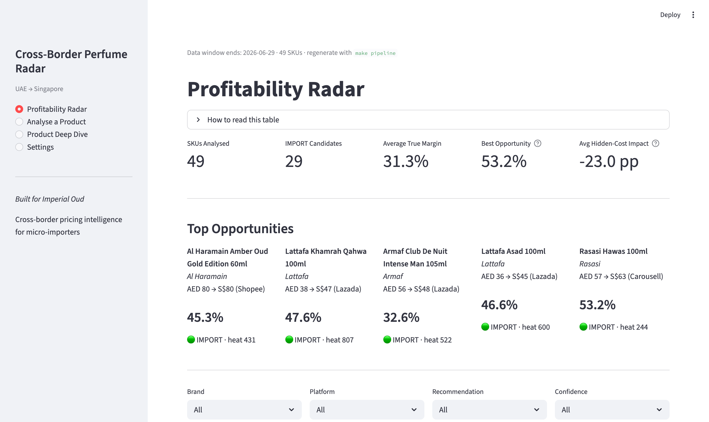
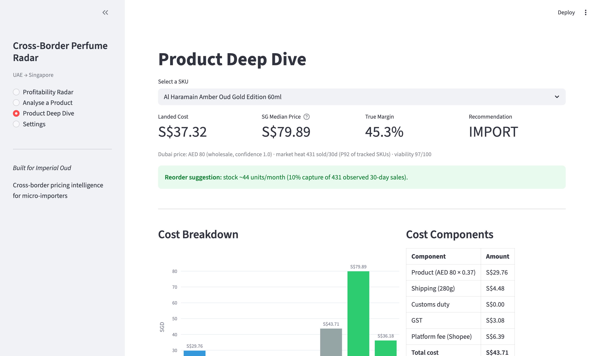

# Cross-Border Perfume Radar

Profitability intelligence for UAE → Singapore perfume micro-imports. Computes the
true landed cost of every SKU (FX + shipping + duty + GST + platform commission),
compares it against Singapore marketplace prices, and ranks import opportunities
by a demand-aware viability score.

## What it does

- **Landed Unit Cost (LUC)** per SKU: Dubai price × FX + weight-based shipping
  + customs duty (0% for HS 3303) + 9% GST on CIF+duty
- **Price bands** (P25/P50) and **market heat** (30-day sold counts) aggregated
  from Singapore listings across Shopee, Lazada and Carousell
- **Dubai price confidence**: wholesale sheet (1.0) → retail proxy (0.6) →
  model-predicted (0.4), with low-confidence SKUs gated out of IMPORT unless
  demand is top-quartile
- **Recommendation** per SKU — IMPORT (≥20% true margin), WATCH (≥10%), SKIP —
  plus naive-vs-true margin so you can see exactly what the hidden costs eat

## Dashboard

| Page | What it shows |
|---|---|
| Profitability Radar | Ranked SKU table, filters, top opportunities, CSV + Top-10 export |
| Analyse a Product | Manual calculator with cost waterfall and price estimator |
| Product Deep Dive | Per-SKU cost breakdown, matched listings, optimal route, reorder suggestion |
| Settings | Live FX/GST/shipping/fee overrides (defaults from `config/cost_rules.yml`) |




## How it works

```
data/samples/                    perfume_radar/etl/build_dataset.py       app.py
products.csv      ─┐            1. fuzzy-match titles → product_id      Streamlit
sg_listings.csv   ─┼──────────▶ 2. aggregate bands + heat        ─────▶ dashboard
dubai_prices.csv  ─┤            3. resolve Dubai price (w/p/pred)       (recomputes
synonyms.csv      ─┘            4. cost + score (analysis.enrich)        live from
                                → data/processed/analysis_snapshot.csv   the snapshot)
```

## Quick start

```bash
git clone https://github.com/osaidd/Cross-Border-Perfume-Radar.git
cd Cross-Border-Perfume-Radar
make install          # pip install -e ".[dev,scrapers]"
make run              # streamlit run app.py (uses the committed snapshot)
```

Regenerate everything from source: `make data && make pipeline`. Run checks:
`make lint && make test`.

## Data

Everything in this repo is reproducible from the repo itself. `data/samples/`
holds a synthetic-but-realistic demo dataset (49 SKUs across 8 fragrance brands,
four weekly listing rounds ending 2026-06-29) generated deterministically by
`scripts/author_sample_data.py` — prices reflect real market levels, but no
scraped records are shipped. `data/processed/` holds the committed pipeline
output; `tests/test_pipeline.py` fails if it drifts from the inputs.

The scrapers in `scrapers/` are documented **reference implementations** of the
collection approach (rate limits, robots.txt compliance, selector strategy);
they are not wired into the pipeline.

## Key parameters (`config/cost_rules.yml`, overridable live in Settings)

| Parameter | Default | Notes |
|---|---|---|
| FX rate | 0.37 SGD/AED | override via `config/.env` |
| Shipping | S$16/kg | linear small-parcel rate |
| Customs duty | 0% | HS 3303 fragrances duty-free in SG |
| GST | 9% | applied to CIF + duty |
| Shopee / Lazada / Carousell fee | 8% / 6% / 0% | commission incl. processing |

## Engineering

Python ≥3.11 · pandas · scikit-learn · rapidfuzz · Streamlit · Plotly.
`pytest` suite includes the three PRD acceptance tests by name and
`streamlit.testing.AppTest` smoke tests for every page; `ruff` for lint/format;
GitHub Actions CI on 3.11/3.12. See `docs/PRD.md` (requirements),
`docs/data_workflow.md` (pipeline internals) and `docs/case_study.md`
(three SKU walkthroughs).

## Background

Built for Imperial Oud, a small cross-border venture between Singapore and the
UAE, to replace spreadsheet-and-guesswork sourcing decisions with a repeatable
landed-cost analysis. This repo is the productised demo of that workflow.
